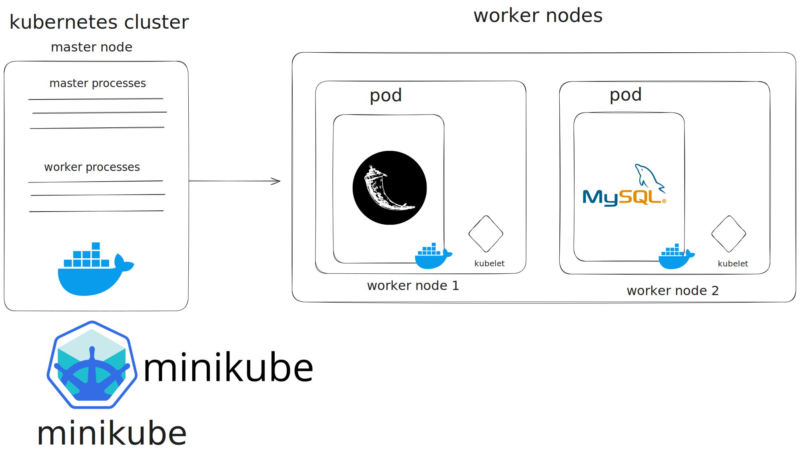

# Arquitectura y configuración k8s

### Serie II

##### Diego Andres Huite Alvarez - 202003585

[**Link video**](https://drive.google.com/file/d/1az6EI36DoJgl8lzXij4j-JU60b4Jbpfu/view?usp=sharing)

## Arquitectura inicial de la aplicación en k8s:



Para la implementación de la aplicación se hizo uso de minikube que esta corriendo un cluster de kubernetes en un contenedor de docker, esta app está conformada por una api en flask y un db en mysql

**Componentes:**

1. **Minikube Node:**
   
   - Master node
   - Proporciona el entorno de ejecución para la aplicación Kubernetes.

2. **Deployment y Pod - Flask:**
   
   - Deployment: `flask-deployment-dhuite202003585`
   - Pod: `flask-final`
   - Imagen del contenedor: `dgo45921/flask-final:final`
   - Puertos expuestos: 8080
   - Variables de entorno: FLASK_ENV establecido como "production"

3. **Service - Flask:**
   
   - Service: `flask-service`
   - Tipo: NodePort
   - Mapeo del puerto: Nodo (30000) a Contenedor (8080)

4. **Deployment y Pod - MySQL:**
   
   - Deployment: `mysql-deployment-dhuite202003585`
   - Pod: `mysql`
   - Imagen del contenedor: `dgo45921/mysql-final:latest`
   - Puertos expuestos: 3306
   - Variables de entorno: MYSQL_ROOT_PASSWORD establecido como "root"

5. **Service - MySQL:**
   
   - Service: `mysql-service`
   - Puertos expuestos: Nodo (3306) a Contenedor (3306)

## Documentación de Archivos YAML de Configuración en Kubernetes:

### 1. YAML para Flask (`flask-deployment.yaml` y `flask-service.yaml`):

**1.1. `flask-deployment.yaml`:**

```yaml
apiVersion: apps/v1
kind: Deployment
metadata:
  name: flask-deployment-dhuite202003585
  labels:
    app: flask-final
spec:
  replicas: 1
  selector:
    matchLabels:
      app: flask-final
  template:
    metadata:
      labels:
        app: flask-final
    spec:
      containers:
      - name: flask-final
        image: dgo45921/flask-final:finale
        ports:
        - containerPort: 8080
        env:
        - name: FLASK_ENV
          value: "production"
```

**Descripción:**

- Crea un Deployment llamado `flask-deployment-dhuite202003585`.
- Especifica 1 réplica del Pod asociado.
- Elige Pods con la etiqueta `app: flask-final`.
- Define un contenedor llamado `flask-final` usando la imagen `dgo45921/flask-final:final`.
- Expone el puerto 8080 del contenedor.
- Configura la variable de entorno `FLASK_ENV` como "production".

**1.2. `flask-service.yaml`:**

```yaml
apiVersion: v1
kind: Service
metadata:
  name: flask-service
  labels:
    app: flask-final
spec:
  selector:
    app: flask-final
  ports:
  - name: http
    protocol: TCP
    port: 30000 
    targetPort: 8080 
  type: NodePort
```

**Descripción:**

- Crea un Service llamado `flask-service`.
- Selecciona Pods con la etiqueta `app: flask-final`.
- Mapea el puerto del nodo (30000) al puerto del contenedor (8080) mediante el tipo NodePort.

### 2. YAML para MySQL (`mysql-deployment.yaml` y `mysql-service.yaml`):

**2.1. `mysql-deployment.yaml`:**

```yaml
apiVersion: apps/v1
kind: Deployment
metadata:
  name: mysql-deployment-dhuite202003585
  labels:
    app: mysql
spec:
  replicas: 1
  selector:
    matchLabels:
      app: mysql
  template:
    metadata:
      labels:
        app: mysql
    spec:
      containers:
      - name: mysql
        image: dgo45921/mysql-final:latest
        env:
        - name: MYSQL_ROOT_PASSWORD
          value: root
        ports:
        - containerPort: 3306
```

**Descripción:**

- Crea un Deployment llamado `mysql-deployment-dhuite202003585`.
- Especifica 1 réplica del Pod asociado.
- Elige Pods con la etiqueta `app: mysql`.
- Define un contenedor llamado `mysql` usando la imagen `dgo45921/mysql-final:latest`.
- Configura la variable de entorno `MYSQL_ROOT_PASSWORD` como "root".
- Expone el puerto 3306 del contenedor.

**2.2. `mysql-service.yaml`:**

```yaml
apiVersion: v1
kind: Service
metadata:
  name: mysql-service
  labels:
    app: mysql
spec:
  selector:
    app: mysql
  ports:
  - name: mysql
    protocol: TCP
    port: 3306
    targetPort: 3306
```

**Descripción:**

- Crea un Service llamado `mysql-service`.
- Selecciona Pods con la etiqueta `app: mysql`.
- Expone el puerto 3306 del nodo y del contenedor.
